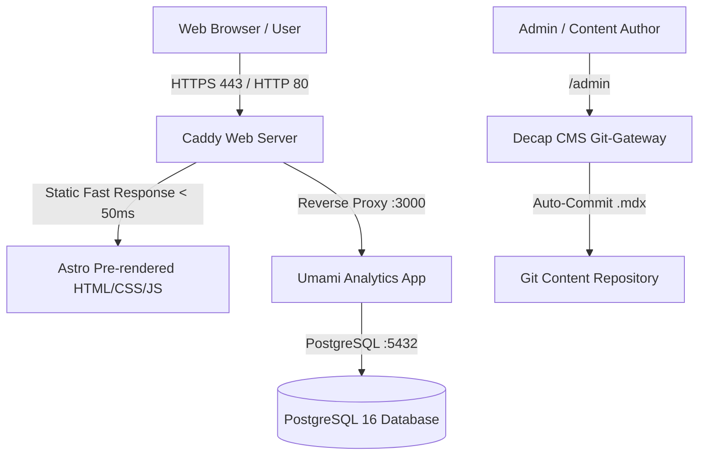

# 🚀 The Ramadhani — Authority Personal Brand Website

> **High-Performance Static Portfolio & Thought Leadership Platform for Technical SEO, Generative Engine Optimization (GEO), and High-ROI Google Ads Consulting.**

[](https://astro.build)
[](https://react.dev)
[](https://tailwindcss.com)
[](https://caddyserver.com)
[](https://umami.is)
[](https://pagespeed.web.dev)

---

## 📖 Ringkasan Proyek

Website ini dibangun menggunakan arsitektur modern **Jamstack & Static Site Generation (SSG)** dengan Astro 5, menghasilkan halaman web murni statis yang disajikan oleh web server Caddy dengan kompresi tingkat lanjut (Zstandard, Brotli, Gzip) dan otomatisasi sertifikat SSL HTTPS Let's Encrypt.

Platform ini dilengkapi dengan:
- ⚡ **Core Web Vitals Optimal**: LCP Sub-detik (< 0.8s), CLS 0.00, FCP < 0.4s.
- 🤖 **GEO & AI Search Machine-Readability**: Integrasi direct answer blocks, semantic JSON-LD Knowledge Graph, dan directive `llms.txt` untuk optimasi kutipan mesin pencari AI (Perplexity, ChatGPT Search, Google AI Overviews).
- 📊 **Self-Hosted Umami Analytics**: Pelacak analitik web tanpa cookie yang patuh GDPR/CCPA dengan perekam sesi heatmap real-time.
- ✍️ **Decap CMS**: Manajemen konten headless berbasis Git untuk publikasi artikel dan studi kasus klien secara visual.
- 🛠️ **Suite Otomasi Lengkap**: Script deployment Docker Hub, direct SCP deploy, hot-reload Caddy (50ms), dan migrasi server 1-klik.

---

## 📑 Daftar Isi

1. [Arsitektur & Tech Stack](#-arsitektur--tech-stack)
2. [Struktur Direktori](#-struktur-direktori)
3. [Panduan Menjalankan di Lingkungan Lokal](#-panduan-menjalankan-di-lingkungan-lokal)
4. [Panduan Manajemen Konten (Decap CMS)](#-panduan-manajemen-konten-decap-cms)
5. [Fitur-Fitur Interaktif](#-fitur-fitur-interaktif)
6. [Panduan Deployment ke Server Produksi](#-panduan-deployment-ke-server-produksi)
7. [Panduan Umami Analytics](#-panduan-umami-analytics)
8. [Menambahkan Reverse Proxy Aplikasi Lain](#-menambahkan-reverse-proxy-aplikasi-lain)
9. [Backup & Migrasi Server](#-backup--migrasi-server)
10. [Lighthouse CI & Quality Gate](#-lighthouse-ci--quality-gate)

---

## 🏗️ Arsitektur & Tech Stack



### Rincian Teknologi:
- **Framework Utama**: [Astro 5](https://astro.build) (Mode: `output: 'static'`)
- **Islands Architecture**: [React 19](https://react.dev) (Dengan direktif `client:visible` untuk zero main-thread blocking)
- **Styling**: [Tailwind CSS 3](https://tailwindcss.com) + `@tailwindcss/typography`
- **Web Server Produksi**: [Caddy 2](https://caddyserver.com) dengan Automatic HTTPS, HTTP/2, HTTP/3, Zstandard & Gzip
- **Analytics & Heatmaps**: [Umami Analytics](https://umami.is) dengan PostgreSQL 16 Alpine
- **Content Management**: [Decap CMS 3](https://decapcms.org) dengan Content Collections Type-Safe Schema

---

## 📁 Struktur Direktori

```text
├── .github/
│   └── workflows/
│       └── lhci.yml            # Pipeline CI/CD untuk audit Lighthouse otomatis
├── public/
│   ├── admin/
│   │   └── config.yml          # Konfigurasi skema Decap CMS
│   ├── images/                 # Aset gambar, poster WebP, dan logo
│   │   ├── uploads/            # Folder upload media CMS
│   │   └── hero-poster.webp    # High-priority hero poster image
│   ├── videos/                 # Background video stream MP4
│   ├── favicon.svg             # Favicon vektor
│   ├── llms.txt                # Directive ringkasan untuk LLM / AI Search Bot
│   └── robots.txt              # Aturan crawler Google & AI Bot
├── src/
│   ├── components/
│   │   ├── cards/              # Komponen ArticleCard & ServiceCard
│   │   ├── common/             # Header, Footer, Breadcrumbs, QuickAnswer
│   │   ├── islands/            # React Islands (PerformanceAudit, WorkFilter, dll)
│   │   └── seo/                # BaseHead (Preloads, Fonts, SEO) & JsonLd
│   ├── content/                # Content Collections MDX
│   │   ├── articles/           # File artikel & panduan (.mdx)
│   │   └── work/               # File studi kasus klien (.mdx)
│   ├── layouts/                # BaseLayout, ArticleLayout, WorkLayout
│   ├── pages/                  # Routing halaman website statis
│   │   ├── admin/              # Rute portal CMS (/admin)
│   │   ├── articles/           # Rute artikel (/articles)
│   │   ├── services/           # Rute layanan (/services/seo, /geo, /google-ads)
│   │   ├── work/               # Rute studi kasus (/work)
│   │   ├── about.astro         # Halaman tentang profil
│   │   ├── contact.astro       # Halaman form konsultasi
│   │   ├── index.astro         # Halaman utama (Homepage)
│   │   └── rss.xml.ts          # Generator feed RSS otomatis
│   ├── styles/
│   │   └── global.css          # Desain sistem tokens, animasi, & base layer
│   ├── types/                  # Schema types & interfaces TypeScript
│   └── content.config.ts       # Skema validasi Zod untuk artikel & studi kasus
├── Caddyfile                   # Konfigurasi web server Caddy produksi
├── Dockerfile                  # Multi-stage production build Dockerfile
├── docker-compose.prod.yml     # Konfigurasi container Caddy, Umami, & PostgreSQL
├── .lighthouserc.json          # Konfigurasi Lighthouse CI Quality Gate
├── deploy-dockerhub.sh         # Script deploy via Docker Hub
├── deploy.sh                   # Script deploy langsung via SSH / SCP
├── reload-caddy.sh             # Script hot-reload Caddy (50ms zero-downtime)
├── backup-server.sh            # Script backup database & konfigurasi otomatis
├── restore-server.sh           # Script restore & bootstrap server baru
├── migrate.sh                  # Script migrasi server 1-klik
└── sync-from-server.sh         # Script unduh database & media produksi ke lokal
```

---

## 💻 Panduan Menjalankan di Lingkungan Lokal

### Prasyarat:
- Node.js versi 20 atau 22 (LTS)
- Git

### Langkah Instalasi:

1. **Clone & Masuk ke Direktori Proyek**:
   ```bash
   git clone <url_repo_anda>
   cd ramadhani2
   ```

2. **Install Dependencies**:
   ```bash
   npm install
   ```

3. **Jalankan Server Development**:
   ```bash
   npm run dev
   ```
   Buka browser di **`http://localhost:4321`**.

4. **Menjalankan Website + Local CMS Backend Sekaligus**:
   ```bash
   npm run dev:all
   ```
   - Website: `http://localhost:4321`
   - Decap CMS Portal: `http://localhost:4321/admin`

---

## ✍️ Panduan Manajemen Konten (Decap CMS)

### Mengakses CMS Portal
- **Lokal**: `http://localhost:4321/admin`
- **Produksi**: `https://ramadhani.cloud/admin`

### Menulis Artikel Baru:
1. Buka menu **Articles & Guides** &rarr; klik **New Article**.
2. Isi kolom wajib:
   - **Title**: Judul artikel yang menarik.
   - **Description**: Ringkasan meta description (140-160 karakter).
   - **Quick Answer Block**: Ringkasan kesimpulan langsung (40-60 kata) yang akan dirender di bawah H1 untuk kutipan AI Overviews & Perplexity.
   - **Cover Image**: Pilih diagram/gambar artikel dari media library.
   - **Tags**: Label topik (misal: `SEO`, `GEO`, `Google Ads`).
   - **Body**: Tulis isi artikel menggunakan Markdown/MDX.
3. Klik **Publish** &rarr; Artikel otomatis tersimpan di `src/content/articles/` dan halaman statis baru akan dibangun.

### Menambahkan Studi Kasus Klien:
1. Buka menu **Case Studies & Work** &rarr; klik **New Case Study**.
2. Masukkan metrik kunci pada **Key Impact Metrics** (contoh: `+310%` / `AI Answer Citations` atau `5.2x` / `ROAS`).
3. Pilih apakah studi kasus ingin ditampilkan di Homepage (`Featured: Yes/No`).
4. Klik **Publish**.

---

## ⚡ Fitur-Fitur Interaktif

1. **Live Core Web Vitals & GEO Search Readiness Audit (`PerformanceAudit.tsx`)**:
   - Terpasang di homepage.
   - Pengunjung dapat memasukkan URL domain mereka untuk melakukan audit live ke **Google PageSpeed Insights V5 API**.
   - Menilai kesiapan halaman terhadap mesin pencari AI (RAG latency timeout, Schema Knowledge Graph, dan AI Overviews fit).
2. **Dynamic Work Filter (`WorkFilter.tsx`)**:
   - Filter portfolio instan berdasarkan kategori layanan (*Technical SEO, GEO, Google Ads*).
3. **Article Search & Tag Filter (`ArticleFilter.tsx`)**:
   - Pencarian artikel real-time dengan filter tag kategori.
4. **FAQ Accordion dengan Schema JSON-LD Otomatis (`FaqAccordion.tsx`)**:
   - Accordion interaktif yang otomatis menyuntikkan data terstruktur `FAQPage` ke mesin pencari.

---

## 🚀 Panduan Deployment ke Server Produksi

### Konfigurasi `.env` Produksi:
Pastikan file `.env` di server produksi telah disesuaikan:
```env
SITE_DOMAIN=ramadhani.cloud
SITE_URL=https://ramadhani.cloud
ACME_EMAIL=ramanur321@gmail.com
WEB_IMAGE=username/ramadhani-web:latest
UMAMI_DB_NAME=umami_analytics
UMAMI_DB_USER=umami_admin
UMAMI_DB_PASSWORD=password_aman_anda
UMAMI_APP_SECRET=secret_32_karakter_acak
PUBLIC_UMAMI_WEBSITE_ID=1caa2dcc-1a6e-4727-be26-0f3e6dc7c05b
PUBLIC_UMAMI_HOST_URL=https://analytics.ramadhani.cloud
```

### Metode 1: Deploy Melalui Docker Hub (Direkomendasikan)
Bangun image di lokal, push ke Docker Hub, lalu jalankan di VPS:
```bash
./deploy-dockerhub.sh <username_dockerhub> root <IP_VPS>
```

### Metode 2: Deploy Langsung Melalui SCP
```bash
./deploy.sh root <IP_VPS> /path/ke/ssh_key
```

### Metode 3: Menjalankan Secara Native Tanpa Docker
Baca panduan lengkap di [Panduan Native Linux](#) atau jalankan:
```bash
npm run build && sudo systemctl reload caddy
```

---

## 📊 Panduan Umami Analytics

1. **URL Akses Dashboard**:
   - **Produksi**: `https://analytics.ramadhani.cloud`
   - **Direct Port VPS**: `http://103.175.217.71:3000`
2. **Kredensial Default**:
   - Username: `admin`
   - Password: `umami` *(Wajib segera diubah setelah login di menu Settings &rarr; Profile)*
3. **Fitur yang Aktif**:
   - Perekaman pageviews real-time tanpa cookie.
   - Perekaman sesi visual & heatmap (*recorder.js*).
   - Kompatibilitas navigasi instan Astro View Transitions.

---

## 🔀 Menambahkan Reverse Proxy Aplikasi Lain

Jika Anda ingin menjalankan aplikasi lain di VPS yang sama (misal API backend di port `8080` atau subdomain baru `app.ramadhani.cloud`):

1. **Edit `Caddyfile`**:
   ```caddy
   app.{$SITE_DOMAIN:ramadhani.cloud} {
       reverse_proxy host.docker.internal:8080
   }
   ```
2. **Reload Caddy Tanpa Restart Container (Zero-Downtime)**:
   ```bash
   ./reload-caddy.sh
   ```
   *(Atau jalankan: `docker exec ramadhani-web-prod caddy reload --config /etc/caddy/Caddyfile`)*.
3. Caddy akan otomatis menerbitkan sertifikat SSL HTTPS untuk subdomain baru dalam waktu **50 milidetik**.

---

## 📦 Backup & Migrasi Server

Seluruh tools otomasi migrasi telah tersedia di root repository:

| Aksi | Perintah |
| :--- | :--- |
| **Migrasi 1-Klik ke Server Baru** | `./migrate.sh <IP_LAMA> <IP_BARU> root ~/.ssh/id_rsa` |
| **Backup Sistem di VPS** | `./backup-server.sh` |
| **Restore di VPS Baru** | `./restore-server.sh <file_backup.tar.gz>` |
| **Tarik Database & Media ke Komputer Lokal** | `./sync-from-server.sh <IP_VPS> root ~/.ssh/id_rsa` |

Baca petunjuk lengkapnya di [MIGRATION.md](file:///wsl.localhost/Ubuntu/home/ramadhani/ramadhani2/MIGRATION.md).

---

## 🛡️ Lighthouse CI & Quality Gate

Pipeline GitHub Actions [`.github/workflows/lhci.yml`](file:///wsl.localhost/Ubuntu/home/ramadhani/ramadhani2/.github/workflows/lhci.yml) secara otomatis memvalidasi kualitas kode pada setiap *Pull Request* dan *Push*:

- **Performance**: Skor Minimal &ge; 85%
- **Accessibility**: Skor Minimal &ge; 90%
- **Best Practices**: Skor Minimal &ge; 90%
- **SEO**: Skor Minimal &ge; 95%
- Konfigurasi: [`.lighthouserc.json`](file:///wsl.localhost/Ubuntu/home/ramadhani/ramadhani2/.lighthouserc.json)

---

## 📄 Lisensi & Hak Cipta

&copy; 2026 **The Ramadhani**. Engineered for performance, authority, and answer search.
